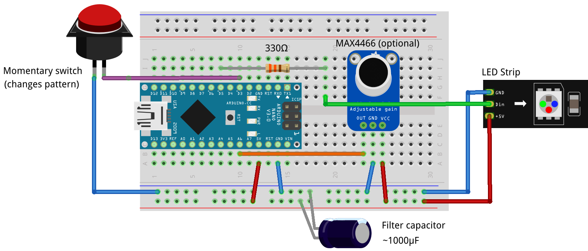

# LEDMask
Arduino code using FastLED to display patterns on an irregular matrix, in this case a slightly disturbing looking mask. It will run on pretty much anything from the Nano upwards, and will compile for the ESP32 / ESP8266 etc.
## Video guides
Tutorial showing how to use FastLED to draw to irregular-shaped matrices. Use the code in the folder `Mask` if you are following along with this video.

Follow-up video showing how I built the electronics and enclosure. The code for this version is given above in the folder `MaskUpdate`. It is slightly different in that it supports three buttons now, one for changing the mode as earlier, and the other two for changing the brightness on most patterns, and changing sound sensitivity on the sound-reactive one.

## Trying this yourself
You won't be able to use my code exactly as written, as you will have to adapt it to your particular matrix. For more information on how to do this, see the video link above. Download the repository as a zip file and unzip it somewhere. `SimpleIrregularMatrix` is the code used in the video to demonstrate how to interact with the matrix. `Mask` is the complete mask code with all of the patterns. The circuit is shown below.
The microphone is optional, it enables the 'Sound' pattern to respond to your voice (or other noises). Without it, the rest of the patterns will still work. The filter capacitor is not optional if you are using the microphone. Without it, the microphone signal is very noisy and so the 'Sound' pattern doesn't work. Short-pressing the button cycles through the patterns, whilst a long-press will set it to change the pattern automatically every 10 seconds.

## Why are the patterns all classes?
Ah, glad you asked! This was originally written for the Arduino Nano which is relatively short of RAM. Using large numbers of LEDs with the Nano quickly consumes the available memory so it's difficult to write multiple patterns. By writing each pattern as a class, the variables and arrays that each pattern needs are only held in RAM while that pattern is active. As soon as the pattern changes, the class object loses scope and releases the RAM to be used by the next pattern. In this way we can add many more patterns than we otherwise would be able to.
